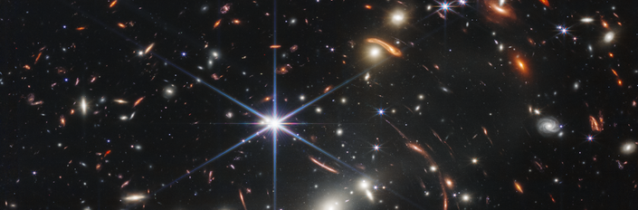

<!-- CSSを適用 -->
<link rel="stylesheet" href="{{'/css/style.css'|relative_url}}">

 Date
Dec 18th, Wednesday, 2024
  

  Places  

Room 908 in Science Building 1
Department of Physics, University of Tokyo
Access is [here](https://www.phys.s.u-tokyo.ac.jp/en/access/)
 
 

  Speakers  

- Dr. Mahsa Kohandel (Scuola Normale Superiore)
- Dr. Aswin Vijayan  (University of Sussex)
- Ms. Yurina Nakazato (The University of Tokyo)
  

## Program Schedule

| Time          | Session                                   | Speaker        |
|---------------|-------------------------------------------|----------------|
| 13:00 - 13:20 | Summary of z > 10 observations by ALMA (slides provided by Dr. Jorge Zavala) | Yurina Nakazato |
| 13:20 - 13:45 | SERRA simulations                        | Mahsa Kohandel  |
| 13:45 - 14:00 | Q and A                                  |                |
| 14:00 - 14:25 | FLARES simulations                       | Aswin Vijayan   |
| 14:25 - 14:40 | Q and A                                  |                |
| 14:40 - 15:05 | FirstLight simulations                   | Yurina Nakazato |
| 15:05 - 15:20 | Q and A                                  |                |
| 15:20 - 15:30 | Coffee Break                             |                |
| 15:30 - 17:00 | Discussion                               |                |

